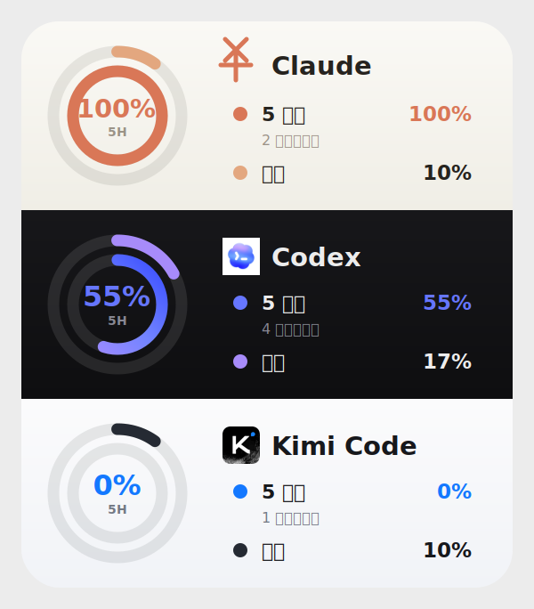

# AI Agent Usage Widget / AI Agent 用量组件

一个用于 macOS [Übersicht](https://tracesof.net/uebersicht/) 的桌面组件，
集中显示 Claude、Codex 和 Kimi Code 的用量。

A compact macOS [Übersicht](https://tracesof.net/uebersicht/) widget that shows
Claude, Codex, and Kimi Code usage in one place.



## 功能 / Features

- 五小时用量、每周用量和重置倒计时
- Five-hour usage, weekly usage, and reset countdowns
- 三个提供商相互隔离，单个失败不会隐藏其他面板
- Providers fail independently, so one error never hides the other panels
- 旧数据状态提示，避免把缓存或过期快照误认为实时数据
- Stale-data indicators prevent cached or expired snapshots from appearing live
- 每 60 秒自动刷新，固定在桌面右下角
- Automatic 60-second refresh, anchored to the desktop bottom-right corner

## 工作方式 / How It Works

- **Claude：**只读访问 macOS Keychain 中 Claude Code 已有的 OAuth 令牌，并
  调用 Anthropic 用量接口。组件不会刷新、保存或打印令牌。
- **Claude:** reads the existing Claude Code OAuth token from macOS Keychain
  and calls Anthropic's usage endpoint. It never refreshes, stores, or prints
  the token.
- **Codex：**读取本地 Codex 会话 JSONL 中最近一次模型响应附带的限额快照，
  不访问凭据，也不发送模型请求。
- **Codex:** reads the latest rate-limit snapshot from local Codex session
  JSONL files. It does not access credentials or make model requests.
- **Kimi Code：**读取 Kimi Code CLI 的本地 OAuth 访问令牌，并调用官方
  `https://api.kimi.com/coding/v1/usages` 接口。不会读取浏览器 Cookie，也不会
  刷新 OAuth 令牌。
- **Kimi Code:** reads the local Kimi Code CLI OAuth access token and calls the
  official `https://api.kimi.com/coding/v1/usages` endpoint. It never reads
  browser cookies or refreshes OAuth tokens.

Claude 和 Kimi 成功响应缓存五分钟以减少请求；Codex 快照会检查重置时间。

Successful Claude and Kimi responses are cached for five minutes. Codex
snapshots are checked against their reset times.

## 要求 / Requirements

- macOS
- [Übersicht](https://tracesof.net/uebersicht/)
- Python 3
- `curl`
- 至少使用过 Claude Code、Codex 或 Kimi Code CLI 中的一项
- At least one of Claude Code, Codex, or Kimi Code CLI used once

```bash
python3 --version
curl --version
```

## 快速安装 / Quick Start

### 下载 ZIP / Download ZIP

1. 在 GitHub 仓库的 **Code** 菜单选择 **Download ZIP**。
2. 解压后打开终端，输入 `cd `（末尾有空格），把解压目录拖进终端并回车。
3. In GitHub's **Code** menu, choose **Download ZIP**. Extract it, type `cd `
   in Terminal, drag the extracted folder into Terminal, and press Return.
4. 运行 / Run:

```bash
cd usage-widget
bash install.sh
```

### Git 克隆 / Git Clone

```bash
git clone https://github.com/lazyfoxy33-dev/ai-agent-usage-widget.git
cd ai-agent-usage-widget/usage-widget
bash install.sh
```

打开或重启 Übersicht，并在菜单中启用 `usage-widget`。安装位置：

Open or restart Übersicht and enable `usage-widget` from its menu. Install
location:

```text
~/Library/Application Support/Übersicht/widgets/usage-widget/
```

## 首次使用 / First Use

1. 正常使用需要显示的官方客户端至少一次。
2. Use each official client you want to display at least once.
3. 安装组件并启动 Übersicht，首次显示最多等待一分钟。
4. Install the widget, start Übersicht, and allow up to one minute for the
   first refresh.
5. 若 macOS 询问 Python 或 `security` 是否可访问 Claude Code Keychain 项，
   只有在你希望显示 Claude 用量时才允许。
6. If macOS asks whether Python or `security` may access the Claude Code
   Keychain item, allow it only if you want Claude usage displayed.

界面标签 / Interface labels:

- `5 小时`: 滚动五小时用量 / rolling five-hour usage
- `本周`: 每周用量 / weekly usage
- `后重置`: 距离重置的时间 / time remaining until reset

## 提供商设置 / Provider Setup

### Claude

正常登录并使用 Claude Code。令牌过期时，请让官方客户端自行重新登录或刷新。
组件故意不刷新令牌，避免旋转 refresh token 导致官方客户端退出。

Sign in to and use Claude Code normally. When its token expires, let the
official client log in or refresh itself. The widget deliberately avoids token
refresh because rotating refresh tokens could sign the official client out.

### Codex

至少使用 Codex 一次，使其写入包含限额信息的本地会话。Codex 面板显示最近模型
响应的本地快照，并在快照超过重置时间后标记为旧数据。

Use Codex at least once so it writes a session containing rate-limit data. The
panel shows the latest local model-response snapshot and marks it stale after
its reset time.

### Kimi Code

安装当前官方 [Kimi Code CLI](https://github.com/MoonshotAI/kimi-code)：

Install the current official [Kimi Code CLI](https://github.com/MoonshotAI/kimi-code):

```bash
brew install kimi-code
```

也可使用官方安装脚本 / Or use the official installer:

```bash
curl -fsSL https://code.kimi.com/kimi-code/install.sh | bash
```

启动 `kimi`，输入 `/login` 并选择 **Kimi Code OAuth**。当前版本默认把凭据放在
`$KIMI_CODE_HOME/credentials/kimi-code.json`（默认
`~/.kimi-code/credentials/kimi-code.json`）。组件也兼容旧 Kimi CLI 的
`$KIMI_SHARE_DIR` 或 `~/.kimi/credentials/kimi-code.json`。

Start `kimi`, run `/login`, and choose **Kimi Code OAuth**. Current versions
store credentials at `$KIMI_CODE_HOME/credentials/kimi-code.json` (default
`~/.kimi-code/credentials/kimi-code.json`). The widget also supports the
legacy Kimi CLI location under `$KIMI_SHARE_DIR` or
`~/.kimi/credentials/kimi-code.json`.

若没有可用登录，组件只显示提示。可在
[Kimi Code 控制台 / Kimi Code console](https://www.kimi.com/code/console?from=kfc_overview_topbar)
手动查看，但组件不会抓取该网页或读取浏览器 Cookie。

Without a usable login, the panel displays setup guidance. The
[Kimi Code console](https://www.kimi.com/code/console?from=kfc_overview_topbar)
is available for manual viewing, but the widget never scrapes it or reads
browser cookies.

## 网络与代理 / Network And Proxy

Claude 和 Kimi 请求遵循 `HTTPS_PROXY` 或 `https_proxy`。如果未设置，脚本会探测
常见本地代理端口 `7897` 和 `7890`，否则由 `curl` 直连。Codex 只读本地文件，
不使用网络。

Claude and Kimi requests honor `HTTPS_PROXY` or `https_proxy`. If neither is
set, the script probes local ports `7897` and `7890`, then lets `curl` connect
directly. Codex is local-only and uses no network.

## 隐私与安全 / Privacy And Security

- 凭据只在运行时从官方客户端存储位置读取。
- Credentials are read only at runtime from official-client storage.
- 令牌不会写入仓库、缓存、日志或命令行参数。
- Tokens are never written to the repository, cache, logs, or process arguments.
- Claude 用量只发送到 Anthropic；Kimi 用量只发送到 Kimi 官方 API。
- Claude usage goes only to Anthropic; Kimi usage goes only to Kimi's API.
- Codex 数据保留在本机。
- Codex data stays on the local machine.
- 缓存只包含百分比和重置时间。
- Cache files contain percentages and reset times only.

报告安全问题前请阅读 [SECURITY.md](SECURITY.md)。

Read [SECURITY.md](SECURITY.md) before reporting a security issue.

## 排错 / Troubleshooting

直接检查数据源 / Check the data source directly:

```bash
cd usage-widget
python3 fetch_usage.py
```

输出应包含独立的 `claude`、`codex` 和 `kimi` JSON 字段。公开粘贴前务必检查并
清理输出。

The output should contain independent `claude`, `codex`, and `kimi` JSON
fields. Review and sanitize it before posting publicly.

- `claude.reason = "expired"`：打开 Claude Code 并重新登录或发起一次请求。
- `claude.reason = "expired"`: open Claude Code and sign in or make a request.
- `codex.reason = "no_data"`：使用一次 Codex。
- `codex.reason = "no_data"`: use Codex once.
- `kimi.reason = "no_data"`：安装 Kimi Code CLI，并通过 `/login` 登录。
- `kimi.reason = "no_data"`: install Kimi Code CLI and sign in with `/login`.
- `kimi.reason = "expired"`：在 Kimi Code CLI 中重新登录。
- `kimi.reason = "expired"`: sign in again inside Kimi Code CLI.
- `reason = "error"`：检查网络、`curl` 和代理设置。
- `reason = "error"`: check network access, `curl`, and proxy settings.
- `reason = "stale"`：正在显示上次缓存，等待下一次自动刷新。
- `reason = "stale"`: cached data is displayed until a later refresh succeeds.

### 刷新 / Refresh

组件没有可点击的刷新按钮，每 60 秒自动刷新。需要立即重载时，在 Übersicht 菜单
中关闭再启用 `usage-widget`，或重启 Übersicht。

There is no clickable refresh button. The widget refreshes every 60 seconds.
To reload immediately, disable and re-enable `usage-widget` in Übersicht, or
restart Übersicht.

### 更新 / Update

下载新版或执行 `git pull` 后，在新的 `usage-widget` 目录重新运行：

After downloading a new version or running `git pull`, run again from the new
`usage-widget` directory:

```bash
bash install.sh
```

## 卸载 / Uninstall

```bash
rm -rf "$HOME/Library/Application Support/Übersicht/widgets/usage-widget"
rm -rf "$HOME/.cache/usage-widget"
```

## 开发 / Development

```bash
cd usage-widget
python3 -m unittest discover -v
```

贡献说明见 [CONTRIBUTING.md](CONTRIBUTING.md)。

See [CONTRIBUTING.md](CONTRIBUTING.md) for contribution guidance.

## 限制 / Limitations

- Claude OAuth 用量接口不是公开文档 API，未来可能变化。
- The Claude OAuth usage endpoint is undocumented and may change.
- Codex 依赖最近的本地会话快照，不是独立实时 API。
- Codex depends on the latest local session snapshot, not a separate live API.
- Kimi 接口和凭据格式由 Kimi Code CLI 管理，未来版本可能变化。
- Kimi's endpoint and credential format are managed by Kimi Code CLI and may
  change.
- 当前只支持 macOS 和 Übersicht。
- The widget currently targets macOS and Übersicht only.

## 品牌与许可 / Trademarks And License

本项目是非官方开源项目，与 Anthropic、OpenAI 或 Moonshot AI 无隶属或背书关系。
Claude、Codex、Kimi、相关公司名称和 Logo 均属于其各自权利方。

This is an unofficial open-source project and is not affiliated with or
endorsed by Anthropic, OpenAI, or Moonshot AI. Claude, Codex, Kimi, company
names, and logos belong to their respective owners.

项目代码采用 [MIT License](LICENSE)。

Project code is released under the [MIT License](LICENSE).
