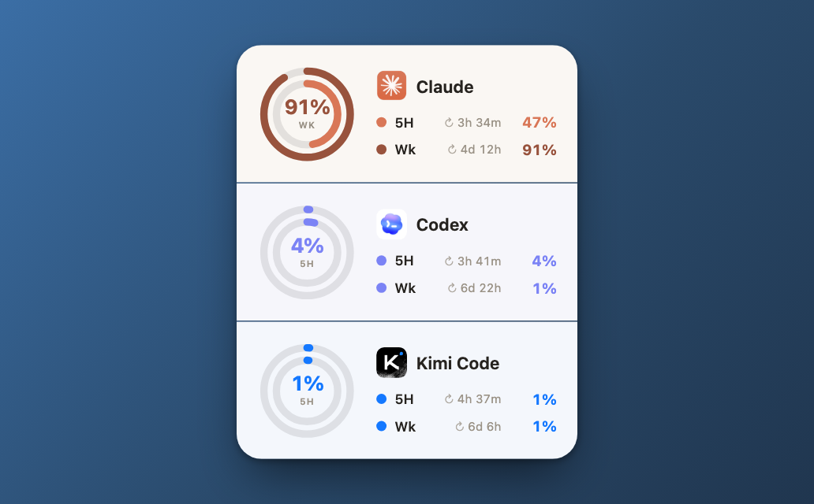
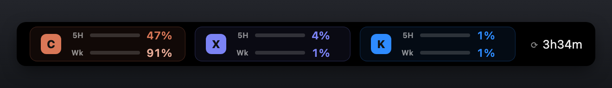
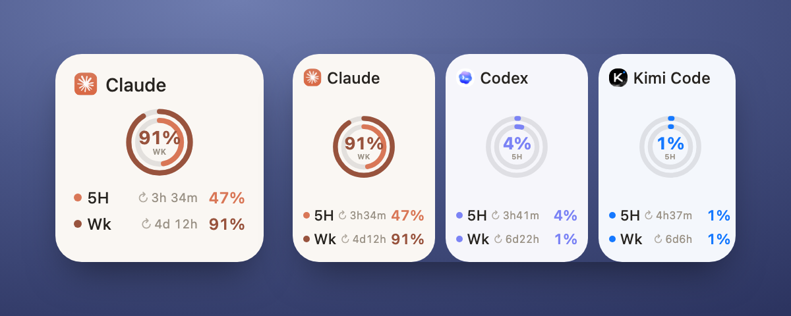

# AI Agent Usage Widget / AI Agent 用量组件

集中显示 Claude、Codex 和 Kimi Code 用量的跨平台工具。同一套数据层
（`core/`）驱动 Übersicht、Touch Bar、macOS WidgetKit 和 Windows Tauri
四个前端。

A cross-platform tool that shows Claude, Codex, and Kimi Code usage in one
place. One shared data layer (`core/`) drives four frontends: Übersicht,
Touch Bar, native macOS WidgetKit, and Windows Tauri.



## 项目结构 / Layout

```text
core/          共享数据层（取数逻辑 + 测试）/ shared data layer (fetchers + tests)
usage-widget/  Übersicht 桌面组件 / Übersicht desktop widget
touchbar/      Touch Bar 组件（Swift）/ Touch Bar frontend (Swift)
macwidget/     macOS WidgetKit 小组件 + 菜单栏伴侣 app
               macOS WidgetKit extension + menu bar companion
windows-widget/ Windows Tauri 无边框桌面组件 / Windows Tauri desktop widget
```

所有前端都消费 `core/fetch_usage.py` 输出的同一份 JSON，并共享相同的新鲜度与
凭据处理策略。
All frontends consume the same JSON from `core/fetch_usage.py` and share the
same freshness and credential-handling policy.

## 功能 / Features

- 五小时用量、每周用量和重置倒计时
- Five-hour usage, weekly usage, and reset countdowns
- 三个提供商相互隔离，单个失败不会隐藏其他面板
- Providers fail independently, so one error never hides the other panels
- 旧数据状态提示，避免把缓存或过期快照误认为实时数据
- Stale-data indicators prevent cached or expired snapshots from appearing live
- 每 60 秒检查数据，成功响应最多缓存五分钟
- Checks data every 60 seconds and caches successful responses for five minutes
- 默认固定在桌面左上角
- Anchored to the desktop top-left corner by default
- 跟随系统浅色 / 深色外观，并按已用量显示语义告急色（注意 / 告急）
- Follows the system light / dark appearance with semantic usage colors
- macOS 原生 WidgetKit 小组件与 Windows 无边框桌面窗
- Native macOS WidgetKit and a frameless Windows desktop window

## 工作方式 / How It Works

- **Claude：**macOS 读取 Keychain；Windows/Linux 读取
  `~/.claude/.credentials.json`。随后调用 Anthropic 用量接口。令牌过期时用其
  refresh token 在官方锁内续期并原子写回（与 Kimi 同协议），续期失败回退过期态。
- **Claude:** reads the macOS Keychain or, on Windows/Linux,
  `~/.claude/.credentials.json`, then calls Anthropic's usage endpoint. When the
  token has expired it is refreshed with its refresh token under the official
  lock and written back atomically (same protocol as Kimi), falling back to the
  expired state on failure.
- **Codex：**读取本地 Codex 会话 JSONL 中最近一次模型响应附带的限额快照，
  默认不访问凭据或发送模型请求。用户可显式开启节流后的主动探测。
- **Codex:** reads the latest rate-limit snapshot from local Codex session
  JSONL files. By default it does not access credentials or make model
  requests. Users may explicitly enable a throttled active probe.
- **Kimi Code：**读取 Kimi Code CLI 的本地 OAuth 访问令牌，并调用官方
  `https://api.kimi.com/coding/v1/usages` 接口。当前 CLI 凭据过期或被拒绝时，
  组件使用 Kimi Code 官方锁与原子存储协议安全续期；旧版凭据保持只读。
- **Kimi Code:** reads the local Kimi Code CLI OAuth access token and calls the
  official `https://api.kimi.com/coding/v1/usages` endpoint. When current CLI
  credentials expire or are rejected, it refreshes them under Kimi Code's
  official lock and atomic-storage protocol. Legacy credentials stay read-only.

组件每 60 秒执行一次，但 Claude 和 Kimi 的成功响应会缓存五分钟，因此正常情况
下最多每五分钟请求一次新用量。缓存过期后会在下一次 60 秒周期请求；若接口失败
或限流，会继续显示最后一次成功缓存并标记为旧数据。Codex 快照会检查重置时间。

The widget runs every 60 seconds, but successful Claude and Kimi responses are
cached for five minutes, so fresh usage is normally requested at most once
every five minutes. After expiry, the next 60-second cycle makes a request. If
the endpoint fails or rate-limits the request, the last successful cache stays
visible and is marked stale. Codex snapshots are checked against their reset
times.

## 要求 / Requirements

- Python 3
- `curl`
- 至少使用过 Claude Code、Codex 或 Kimi Code CLI 中的一项
- At least one of Claude Code, Codex, or Kimi Code CLI used once

各前端的额外要求 / Frontend-specific requirements:

- Übersicht：macOS + [Übersicht](https://tracesof.net/uebersicht/)
- Touch Bar：带 Touch Bar 的 Mac / a Mac with Touch Bar
- WidgetKit：macOS 14+、Xcode 与可注册 App Group 的 Apple Developer Team
- WidgetKit: macOS 14+, Xcode, and an Apple Developer Team for App Groups
- Windows：Windows 10/11 + WebView2；源码构建需 Rust/Tauri
- Windows: Windows 10/11 + WebView2; source builds require Rust/Tauri

```bash
python3 --version
curl --version
```

## 快速安装 / Quick Start

> **macOS 原生小组件与 Touch Bar** 可直接从
> [Releases](https://github.com/lazyfoxy33-dev/ai-agent-usage-widget/releases) 下载
> **已公证**的 DMG（`QuotaWidget.dmg` / `QuotaBar.dmg`），无需自行构建签名（见下方各端小节）。
> Übersicht 与 Windows 端从源码安装。
>
> The **macOS Widget** and **Touch Bar** ship as **notarized** DMGs on
> [Releases](https://github.com/lazyfoxy33-dev/ai-agent-usage-widget/releases)
> (`QuotaWidget.dmg` / `QuotaBar.dmg`) — no build or signing needed (see their
> sections below). Übersicht and Windows install from source.

### 下载 ZIP / Download ZIP

1. 在 GitHub 仓库的 **Code** 菜单选择 **Download ZIP**。
2. 解压后打开终端，输入 `cd `（末尾有空格），把解压目录拖进终端并回车。
3. In GitHub's **Code** menu, choose **Download ZIP**. Extract it, type `cd `
   in Terminal, drag the extracted folder into Terminal, and press Return.
4. 运行 / Run:

```bash
cd usage-widget
bash install.sh
```

### Git 克隆 / Git Clone

```bash
git clone https://github.com/lazyfoxy33-dev/ai-agent-usage-widget.git
cd ai-agent-usage-widget/usage-widget
bash install.sh
```

打开或重启 Übersicht，并在菜单中启用 `usage-widget`。安装位置：

Open or restart Übersicht and enable `usage-widget` from its menu. Install
location:

```text
~/Library/Application Support/Übersicht/widgets/usage-widget/
```

### Touch Bar 组件 / Touch Bar frontend



需要带 Touch Bar 的 Mac。最简单的方式：从
[Releases](https://github.com/lazyfoxy33-dev/ai-agent-usage-widget/releases) 下载
`QuotaBar.dmg`，拖入「应用程序」并打开。或从源码编译并设为登录项：

Requires a Mac with a Touch Bar. Easiest: download `QuotaBar.dmg` from
[Releases](https://github.com/lazyfoxy33-dev/ai-agent-usage-widget/releases), drag
it to Applications, and open it. Or build from source and register it as a login
item:

```bash
cd ai-agent-usage-widget/touchbar
bash install.sh
```

小格显示用量最高的窗口，点一下展开整条详情。详见 [touchbar/README.md](touchbar/README.md)。
The tray cell shows the most-used window; tap to expand the full readout. See
[touchbar/README.md](touchbar/README.md).

### macOS WidgetKit / macOS 原生小组件



最简单的方式：从
[Releases](https://github.com/lazyfoxy33-dev/ai-agent-usage-widget/releases) 下载
已公证的 `QuotaWidget.dmg`，拖入「应用程序」打开，再从小组件库添加
**AI Agent Usage**。若要自行从源码构建，WidgetKit 扩展需用你自己的 Apple Team 与
App Group 签名——详见 [macwidget/README.md](macwidget/README.md)。

Easiest: download the notarized `QuotaWidget.dmg` from
[Releases](https://github.com/lazyfoxy33-dev/ai-agent-usage-widget/releases), drag
it to Applications, open it, then add **AI Agent Usage** from the widget gallery.
To build from source instead, the WidgetKit extension must be signed with your own
Apple Team and App Group — see [macwidget/README.md](macwidget/README.md).

### Windows Tauri / Windows 桌面组件

Windows 组件是可拖动、置顶、记忆位置的无边框窗口，并带系统托盘与开机自启。
构建和使用见 [windows-widget/README.md](windows-widget/README.md)。

The Windows frontend is a draggable, always-on-top frameless window with a
tray menu, saved position, and autostart. See
[windows-widget/README.md](windows-widget/README.md).

## 首次使用 / First Use

1. 正常使用需要显示的官方客户端至少一次。
2. Use each official client you want to display at least once.
3. 安装组件并启动 Übersicht，首次显示最多等待一分钟。
4. Install the widget, start Übersicht, and allow up to one minute for the
   first refresh.
5. 若 macOS 询问 Python 或 `security` 是否可访问 Claude Code Keychain 项，
   只有在你希望显示 Claude 用量时才允许。
6. If macOS asks whether Python or `security` may access the Claude Code
   Keychain item, allow it only if you want Claude usage displayed.

界面标签 / Interface labels:

- `5H`: 滚动五小时用量百分比 / rolling five-hour usage percentage
- `Wk`: 每周用量百分比 / weekly usage percentage
- `↻ …`: 该窗口距离重置的剩余时间 / time until that window resets
- 用量达 70% / 90% 时，数字与图形会加深为「注意 / 告急」色
- At 70% / 90% the figure and chart deepen to an attention / urgent color

## 提供商设置 / Provider Setup

### Claude

正常登录并使用 Claude（CLI 或桌面 App）。令牌每 8 小时过期；若官方客户端没有
自行刷新（如只用桌面 App 的场景），组件会用其 refresh token 在官方锁内续期并
原子写回，使 Claude 长期保持实时。续期失败（如被限流）会退避重试并暂显缓存值。

Sign in to and use Claude (CLI or desktop app) normally. The token expires
every 8 hours; if the official client does not refresh it itself (e.g. when you
use only the desktop app), the widget refreshes it with its refresh token under
the official lock and writes it back atomically, keeping Claude live. A failed
refresh (e.g. rate-limited) backs off and temporarily shows the cached value.

### Codex

至少使用 Codex 一次，使其写入包含限额信息的本地会话。Codex 面板显示最近模型
响应的本地快照，并在快照超过重置时间后标记为旧数据。

Use Codex at least once so it writes a session containing rate-limit data. The
panel shows the latest local model-response snapshot and marks it stale after
its reset time.

可选：若希望长时间未使用 Codex 时也自动获取较新的快照，创建：

Optional: to request a newer snapshot after Codex has been idle, create:

```text
~/.config/ai-agent-usage-widget/config.json
```

```json
{
  "codex_active_refresh": true,
  "codex_refresh_interval_seconds": 1800
}
```

这会按节流周期运行真实的 `codex exec` 请求，产生一条本地 session 并消耗少量
额度。默认值为 `false`；最短间隔为 300 秒。

This runs a real throttled `codex exec` request, creates a local session, and
uses a small amount of quota. The default is `false`; the minimum interval is
300 seconds.

### Kimi Code

安装当前官方 [Kimi Code CLI](https://github.com/MoonshotAI/kimi-code)：

Install the current official [Kimi Code CLI](https://github.com/MoonshotAI/kimi-code):

```bash
brew install kimi-code
```

也可使用官方安装脚本 / Or use the official installer:

```bash
curl -fsSL https://code.kimi.com/kimi-code/install.sh | bash
```

启动 `kimi`，输入 `/login` 并选择 **Kimi Code OAuth**。当前版本默认把凭据放在
`$KIMI_CODE_HOME/credentials/kimi-code.json`（默认
`~/.kimi-code/credentials/kimi-code.json`）。组件也兼容旧 Kimi CLI 的
`$KIMI_SHARE_DIR` 或 `~/.kimi/credentials/kimi-code.json`。

Start `kimi`, run `/login`, and choose **Kimi Code OAuth**. Current versions
store credentials at `$KIMI_CODE_HOME/credentials/kimi-code.json` (default
`~/.kimi-code/credentials/kimi-code.json`). The widget also supports the
legacy Kimi CLI location under `$KIMI_SHARE_DIR` or
`~/.kimi/credentials/kimi-code.json`.

当前 `~/.kimi-code` 凭据需要续期时，组件与官方 CLI 共用
`~/.kimi-code/oauth/kimi-code.lock`，锁后重读并原子写回。旧版 `~/.kimi`
凭据不会被修改。

When current `~/.kimi-code` credentials need refresh, the widget shares
`~/.kimi-code/oauth/kimi-code.lock` with the official CLI, re-reads after
locking, and writes atomically. Legacy `~/.kimi` credentials are never changed.

若没有可用登录，组件只显示提示。可在
[Kimi Code 控制台 / Kimi Code console](https://www.kimi.com/code/console?from=kfc_overview_topbar)
手动查看，但组件不会抓取该网页或读取浏览器 Cookie。

Without a usable login, the panel displays setup guidance. The
[Kimi Code console](https://www.kimi.com/code/console?from=kfc_overview_topbar)
is available for manual viewing, but the widget never scrapes it or reads
browser cookies.

## 隐私与安全 / Privacy And Security

- 凭据只在运行时从官方客户端存储位置读取；旧版 Kimi 凭据保持只读。
- Credentials are read at runtime from official-client storage; legacy Kimi
  credentials stay read-only.
- Claude 与当前 Kimi 凭据仅在官方锁内续期，写回时保留其余字段、原子替换并收紧
  权限（文件 `0600`；macOS 经 Keychain 原位更新）。
- Claude and current Kimi credentials refresh only under the official lock; the
  write-back preserves the other fields, replaces atomically, and tightens
  permissions (`0600` for files; macOS updates the Keychain item in place).
- 令牌不会写入仓库、缓存、日志或命令行参数。
- Tokens are never written to the repository, cache, logs, or process arguments.
- Claude 用量只发送到 Anthropic；Kimi 用量只发送到 Kimi 官方 API。
- Claude usage goes only to Anthropic; Kimi usage goes only to Kimi's API.
- Codex 数据保留在本机。
- Codex data stays on the local machine.
- 缓存只包含百分比和重置时间。
- Cache files contain percentages and reset times only.

报告安全问题前请阅读 [SECURITY.md](SECURITY.md)。

Read [SECURITY.md](SECURITY.md) before reporting a security issue.

## 排错 / Troubleshooting

直接检查数据源 / Check the data source directly:

```bash
cd core
python3 fetch_usage.py
```

输出应包含独立的 `claude`、`codex` 和 `kimi` JSON 字段。公开粘贴前务必检查并
清理输出。

The output should contain independent `claude`, `codex`, and `kimi` JSON
fields. Review and sanitize it before posting publicly.

- `claude.reason = "expired"`：打开 Claude Code 并重新登录或发起一次请求。
- `claude.reason = "expired"`: open Claude Code and sign in or make a request.
- `codex.reason = "no_data"`：使用一次 Codex。
- `codex.reason = "no_data"`: use Codex once.
- `kimi.reason = "no_data"`：安装 Kimi Code CLI，并通过 `/login` 登录。
- `kimi.reason = "no_data"`: install Kimi Code CLI and sign in with `/login`.
- `kimi.reason = "expired"`：在 Kimi Code CLI 中重新登录。
- `kimi.reason = "expired"`: sign in again inside Kimi Code CLI.
- `reason = "error"`：检查网络、`curl` 和代理设置。
- `reason = "error"`: check network access, `curl`, and proxy settings.
- `reason = "rate_limited"`：上游返回 HTTP 429，等待下一次自动刷新。
- `reason = "rate_limited"`: the provider returned HTTP 429; wait for the next
  automatic refresh.
- `reason = "stale"`：正在显示上次缓存，等待下一次自动刷新。
- `reason = "stale"`: cached data is displayed until a later refresh succeeds.

### 刷新 / Refresh

组件没有可点击的刷新按钮，每 60 秒自动刷新。需要立即重载时，在 Übersicht 菜单
中关闭再启用 `usage-widget`，或重启 Übersicht。

There is no clickable refresh button. The widget refreshes every 60 seconds.
To reload immediately, disable and re-enable `usage-widget` in Übersicht, or
restart Übersicht.

### 更新 / Update

下载新版或执行 `git pull` 后，在新的 `usage-widget` 目录重新运行：

After downloading a new version or running `git pull`, run again from the new
`usage-widget` directory:

```bash
bash install.sh
```

## 卸载 / Uninstall

```bash
rm -rf "$HOME/Library/Application Support/Übersicht/widgets/usage-widget"
rm -rf "$HOME/.cache/usage-widget"
```

## 开发 / Development

```bash
cd core && python3 -m unittest discover -v          # 数据层 / data layer
cd usage-widget && python3 -m unittest discover -v  # 桌面组件 / Übersicht widget
cd touchbar && python3 -m unittest discover -v && ./build.sh   # Touch Bar
cd windows-widget && node --test src/render.test.mjs           # Windows 渲染 / render
cd macwidget && QUOTAWIDGET_UNSIGNED=1 ./build.sh              # WidgetKit 构建 / build
```

贡献说明见 [CONTRIBUTING.md](CONTRIBUTING.md)。

See [CONTRIBUTING.md](CONTRIBUTING.md) for contribution guidance.

## 限制 / Limitations

- Claude OAuth 用量接口不是公开文档 API，未来可能变化。
- The Claude OAuth usage endpoint is undocumented and may change.
- Codex 依赖最近的本地会话快照，不是独立实时 API。
- Codex depends on the latest local session snapshot, not a separate live API.
- Codex 主动探测是可选真实请求，会消耗额度。
- Codex active probing is an optional real request that consumes quota.
- Kimi 接口和凭据格式由 Kimi Code CLI 管理，未来版本可能变化。
- Kimi's endpoint and credential format are managed by Kimi Code CLI and may
  change.
- 桌面前端覆盖 macOS（Übersicht、Touch Bar、WidgetKit）与 Windows（Tauri）；Linux 仅有数据层、无原生前端。
- Desktop frontends cover macOS (Übersicht, Touch Bar, WidgetKit) and Windows
  (Tauri); Linux has the data layer only, with no native frontend.

## 品牌与许可 / Trademarks And License

本项目是非官方开源项目，与 Anthropic、OpenAI 或 Moonshot AI 无隶属或背书关系。
Claude、Codex、Kimi、相关公司名称和 Logo 均属于其各自权利方。

This is an unofficial open-source project and is not affiliated with or
endorsed by Anthropic, OpenAI, or Moonshot AI. Claude, Codex, Kimi, company
names, and logos belong to their respective owners.

项目代码采用 [MIT License](LICENSE)。

Project code is released under the [MIT License](LICENSE).
