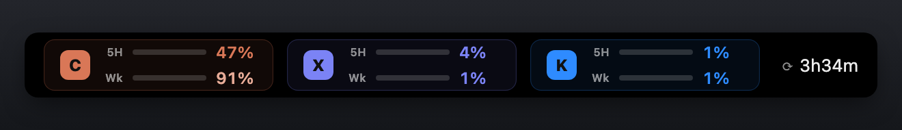

# AI Agent Usage Widget / AI Agent 用量组件

在 macOS 上集中显示 Claude、Codex、Kimi Code 用量与 DeepSeek、SiliconFlow、
OpenRouter 余额：菜单栏常驻图标点开即看，另有一个常驻 Touch Bar 的小组件。
两端共用同一套数据层（`core/`）。

A macOS tool that shows Claude, Codex, and Kimi Code usage plus DeepSeek,
SiliconFlow, and OpenRouter balances from the menu bar, with an always-on Touch
Bar companion. Both frontends share one data layer (`core/`).



## 项目结构 / Layout

```text
core/          共享数据层（取数逻辑 + 测试）/ shared data layer (fetchers + tests)
macwidget/     菜单栏 app：状态栏常驻图标 + 账户设置
               menu bar app: status item + account settings
touchbar/      Touch Bar 组件（Swift）/ Touch Bar frontend (Swift)
```

两个前端都消费 `core/fetch_usage.py` 输出的同一份 JSON，并共享相同的新鲜度与
凭据处理策略。
Both frontends consume the same JSON from `core/fetch_usage.py` and share the
same freshness and credential-handling policy.

### macOS 菜单栏 app / macOS Menu Bar App

先安装 `QuotaWidget.app`，它是 macOS 上的主入口 / Install `QuotaWidget.app`
first; it is the primary entry point on macOS:

- 状态栏常驻图标，点开展示各提供商用量与余额 /
  a status item that expands to per-provider usage and balances
- 配置账号与 API key / configure provider accounts and API keys
- 手动刷新数据 / refresh usage data
- 写入脱敏后的共享状态 / write sanitized shared state
- 安装或更新 Touch Bar 前端 / install or update the Touch Bar frontend

账户设置只把 API key 存进 macOS Keychain，不会写入仓库、缓存或日志。
Account settings keep API keys in the macOS Keychain only; they are never written
to the repository, cache, or logs.

## 功能 / Features

- 五小时用量、每周用量和重置倒计时
- Five-hour usage, weekly usage, and reset countdowns
- 提供商相互隔离，单个失败不会隐藏其他面板
- Providers fail independently, so one error never hides the other panels
- 旧数据状态提示，避免把缓存或过期快照误认为实时数据
- Stale-data indicators prevent cached or expired snapshots from appearing live
- 每 60 秒检查数据，成功响应最多缓存五分钟
- Checks data every 60 seconds and caches successful responses for five minutes
- 跟随系统浅色 / 深色外观，并按已用量显示语义告急色（注意 / 告急）
- Follows the system light / dark appearance with semantic usage colors
- 菜单栏常驻图标点开展示，Touch Bar 上一格常驻小组件
- A menu bar status item that expands on click, plus a Touch Bar companion
- API 余额面板会基于近期本地余额历史估算可用天数（历史不足时不显示猜测）
- API balance panels estimate days remaining from local recent balance history
  when enough data exists, and avoid guessing when history is insufficient

## 工作方式 / How It Works

- **Claude：**macOS 读取 Keychain；Windows/Linux 读取
  `~/.claude/.credentials.json`。随后调用 Anthropic 用量接口。令牌过期时用其
  refresh token 在官方锁内续期并原子写回（与 Kimi 同协议），续期失败回退过期态。
- **Claude:** reads the macOS Keychain or, on Windows/Linux,
  `~/.claude/.credentials.json`, then calls Anthropic's usage endpoint. When the
  token has expired it is refreshed with its refresh token under the official
  lock and written back atomically (same protocol as Kimi), falling back to the
  expired state on failure.
- **Codex：**读取本地 Codex 会话 JSONL 中最近一次模型响应附带的限额快照，
  默认不访问凭据或发送模型请求。用户可显式开启节流后的主动探测。
- **Codex:** reads the latest rate-limit snapshot from local Codex session
  JSONL files. By default it does not access credentials or make model
  requests. Users may explicitly enable a throttled active probe.
- **Kimi Code：**读取 Kimi Code CLI 的本地 OAuth 访问令牌，并调用官方
  `https://api.kimi.com/coding/v1/usages` 接口。当前 CLI 凭据过期或被拒绝时，
  组件使用 Kimi Code 官方锁与原子存储协议安全续期；旧版凭据保持只读。
- **Kimi Code:** reads the local Kimi Code CLI OAuth access token and calls the
  official `https://api.kimi.com/coding/v1/usages` endpoint. When current CLI
  credentials expire or are rejected, it refreshes them under Kimi Code's
  official lock and atomic-storage protocol. Legacy credentials stay read-only.
- **DeepSeek / SiliconFlow / OpenRouter：**读取环境变量中的 API key，调用官方
  账户余额接口，并把每次成功余额快照写入本地缓存以估算近期消耗速度。
- **DeepSeek / SiliconFlow / OpenRouter:** read API keys from environment
  variables, call official account-balance endpoints, and store local balance
  snapshots to estimate recent spend rate.

组件每 60 秒执行一次，但成功响应会缓存五分钟，因此正常情况下每个实时接口最多
每五分钟请求一次。缓存过期后会在下一次 60 秒周期请求；若接口失败或限流，会
继续显示最后一次成功缓存并标记为旧数据。Codex 快照会检查重置时间。

The widget runs every 60 seconds, but successful live responses are cached for
five minutes, so each live endpoint is normally requested at most once every
five minutes. After expiry, the next 60-second cycle makes a request. If the
endpoint fails or rate-limits the request, the last successful cache stays
visible and is marked stale. Codex snapshots are checked against their reset
times.

## 要求 / Requirements

- Python 3
- `curl`
- 至少配置或使用过一个受支持提供商
- At least one supported provider configured or used once

各前端的额外要求 / Frontend-specific requirements:

- 两个前端都需要 macOS 14+ / both frontends require macOS 14+
- Touch Bar：带 Touch Bar 的 Mac / a Mac with Touch Bar

```bash
python3 --version
curl --version
```

## 快速安装 / Quick Start

> **菜单栏 app 与 Touch Bar** 可直接从
> [Releases](https://github.com/lazyfoxy33-dev/ai-agent-usage-widget/releases) 下载
> **Developer ID 签名**的 DMG（`QuotaWidget.dmg` / `QuotaBar.dmg`），公证状态见各 Release 说明（未公证时首次打开需在 Finder 中右键 → 打开）。
>
> The **menu bar app** and the **Touch Bar** frontend ship as **Developer ID-signed** DMGs on
> [Releases](https://github.com/lazyfoxy33-dev/ai-agent-usage-widget/releases)
> (`QuotaWidget.dmg` / `QuotaBar.dmg`); check each release note for notarization
> status (unnotarized builds need right-click → Open on first launch).

### 菜单栏 app / Menu bar app

1. 从 [Releases](https://github.com/lazyfoxy33-dev/ai-agent-usage-widget/releases)
   下载 `QuotaWidget.dmg`（Developer ID 签名），拖入「应用程序」并打开。
2. 状态栏出现常驻图标，点开即可查看各提供商用量与余额。
3. 需要自行从源码构建时，见 [macwidget/README.md](macwidget/README.md)。

1. Download the Developer ID-signed `QuotaWidget.dmg` from
   [Releases](https://github.com/lazyfoxy33-dev/ai-agent-usage-widget/releases),
   drag it to Applications, and open it.
2. A status item appears in the menu bar; click it to see per-provider usage and
   balances.
3. To build from source instead, see [macwidget/README.md](macwidget/README.md).

#### Account settings / 账户设置（macOS app）

在菜单栏点击 QuotaWidget，选择 **Settings...** 打开设置窗口（单页、中文）：

- **本地客户端**：Claude、Codex、Kimi Code 从本机官方客户端读取；未登录时点该行的
  **打开客户端**（Codex 则用 **开启主动探测**）。
- **API 余额**：DeepSeek、SiliconFlow、OpenRouter 点 **添加密钥** 输入 API key，密钥存入
  macOS 钥匙串（服务名 `AI Agent Usage Widget`），可随时 **测试** 或 **移除**；
  SiliconFlow 走 **登录控制台**。
- **Touch Bar**：一行 **安装 / 更新** + **打开**。
- 共享数据层仍支持读取对应 `*_API_KEY` 环境变量，但 app 内的设置为推荐路径。
- 菜单栏 app 与 Touch Bar 前端只交换脱敏后的 JSON 契约，从不接触原始 key。

In the menu bar, click QuotaWidget and choose **Settings...** for a single-page,
Chinese settings window:

- **Local agents**: Claude, Codex, and Kimi Code are read from the official
  clients on this Mac; when not signed in, use **打开客户端** on that row (or
  **开启主动探测** for Codex).
- **API balance**: click **添加密钥** for DeepSeek, SiliconFlow, or OpenRouter
  keys (stored in the macOS Keychain, service `AI Agent Usage Widget`) and use
  **测试** / **移除** at any time; SiliconFlow goes through **登录控制台**.
- **Touch Bar**: a single row with **安装 / 更新** and **打开**.
- The shared data layer still reads the corresponding `*_API_KEY` environment
  variables, but the app's settings are the recommended path.
- The menu bar app and the Touch Bar frontend exchange only the sanitized JSON
  contract and never see raw keys.

### Touch Bar 组件 / Touch Bar frontend


需要带 Touch Bar 的 Mac。最简单的方式：从
[Releases](https://github.com/lazyfoxy33-dev/ai-agent-usage-widget/releases) 下载
`QuotaBar.dmg`，拖入「应用程序」并打开。或从源码编译并设为登录项：

Requires a Mac with a Touch Bar. Easiest: download `QuotaBar.dmg` from
[Releases](https://github.com/lazyfoxy33-dev/ai-agent-usage-widget/releases), drag
it to Applications, and open it. Or build from source and register it as a login
item:

```bash
cd ai-agent-usage-widget/touchbar
bash install.sh
```

小格显示用量最高的窗口，点一下展开整条详情。详见 [touchbar/README.md](touchbar/README.md)。
The tray cell shows the most-used window; tap to expand the full readout. See
[touchbar/README.md](touchbar/README.md).

## 首次使用 / First Use

1. 正常使用需要显示的官方客户端至少一次。
2. Use each official client you want to display at least once.
3. 打开 QuotaWidget.app，首次显示最多等待一分钟。
4. Open QuotaWidget.app and allow up to one minute for the first refresh.
5. 若 macOS 询问 Python 或 `security` 是否可访问 Claude Code Keychain 项，
   只有在你希望显示 Claude 用量时才允许。
6. If macOS asks whether Python or `security` may access the Claude Code
   Keychain item, allow it only if you want Claude usage displayed.

界面标签 / Interface labels:

- `5H`: 滚动五小时用量百分比 / rolling five-hour usage percentage
- `Wk`: 每周用量百分比 / weekly usage percentage
- `↻ …`: 该窗口距离重置的剩余时间 / time until that window resets
- 用量达 70% / 90% 时，数字与图形会加深为「注意 / 告急」色
- At 70% / 90% the figure and chart deepen to an attention / urgent color
- `¥…` / `$…`: API 账户余额 / API account balance
- `近 … 日约可用 … 天`: 基于近期余额下降速度的估算，不足样本时显示暂无趋势
- `≈ … days left`: estimate from recent balance decline; unavailable when
  samples are insufficient

## 提供商设置 / Provider Setup

### Claude

正常登录并使用 Claude（CLI 或桌面 App）。令牌每 8 小时过期；若官方客户端没有
自行刷新（如只用桌面 App 的场景），组件会用其 refresh token 在官方锁内续期并
原子写回，使 Claude 长期保持实时。续期失败（如被限流）会退避重试并暂显缓存值。

Sign in to and use Claude (CLI or desktop app) normally. The token expires
every 8 hours; if the official client does not refresh it itself (e.g. when you
use only the desktop app), the widget refreshes it with its refresh token under
the official lock and writes it back atomically, keeping Claude live. A failed
refresh (e.g. rate-limited) backs off and temporarily shows the cached value.

### Codex

至少使用 Codex 一次，使其写入包含限额信息的本地会话。Codex 面板显示最近模型
响应的本地快照，并在快照超过重置时间后标记为旧数据。

Use Codex at least once so it writes a session containing rate-limit data. The
panel shows the latest local model-response snapshot and marks it stale after
its reset time.

可选：若希望长时间未使用 Codex 时也自动获取较新的快照，创建：

Optional: to request a newer snapshot after Codex has been idle, create:

```text
~/.config/ai-agent-usage-widget/config.json
```

```json
{
  "codex_active_refresh": true,
  "codex_refresh_interval_seconds": 1800
}
```

这会按节流周期运行真实的 `codex exec` 请求，产生一条本地 session 并消耗少量
额度。默认值为 `false`；最短间隔为 300 秒。

This runs a real throttled `codex exec` request, creates a local session, and
uses a small amount of quota. The default is `false`; the minimum interval is
300 seconds.

### Kimi Code

安装当前官方 [Kimi Code CLI](https://github.com/MoonshotAI/kimi-code)：

Install the current official [Kimi Code CLI](https://github.com/MoonshotAI/kimi-code):

```bash
brew install kimi-code
```

也可使用官方安装脚本 / Or use the official installer:

```bash
curl -fsSL https://code.kimi.com/kimi-code/install.sh | bash
```

启动 `kimi`，输入 `/login` 并选择 **Kimi Code OAuth**。当前版本默认把凭据放在
`$KIMI_CODE_HOME/credentials/kimi-code.json`（默认
`~/.kimi-code/credentials/kimi-code.json`）。组件也兼容旧 Kimi CLI 的
`$KIMI_SHARE_DIR` 或 `~/.kimi/credentials/kimi-code.json`。

Start `kimi`, run `/login`, and choose **Kimi Code OAuth**. Current versions
store credentials at `$KIMI_CODE_HOME/credentials/kimi-code.json` (default
`~/.kimi-code/credentials/kimi-code.json`). The widget also supports the
legacy Kimi CLI location under `$KIMI_SHARE_DIR` or
`~/.kimi/credentials/kimi-code.json`.

当前 `~/.kimi-code` 凭据需要续期时，组件与官方 CLI 共用
`~/.kimi-code/oauth/kimi-code.lock`，锁后重读并原子写回。旧版 `~/.kimi`
凭据不会被修改。

When current `~/.kimi-code` credentials need refresh, the widget shares
`~/.kimi-code/oauth/kimi-code.lock` with the official CLI, re-reads after
locking, and writes atomically. Legacy `~/.kimi` credentials are never changed.

若没有可用登录，组件只显示提示。可在
[Kimi Code 控制台 / Kimi Code console](https://www.kimi.com/code/console?from=kfc_overview_topbar)
手动查看，但组件不会抓取该网页或读取浏览器 Cookie。

Without a usable login, the panel displays setup guidance. The
[Kimi Code console](https://www.kimi.com/code/console?from=kfc_overview_topbar)
is available for manual viewing, but the widget never scrapes it or reads
browser cookies.

### DeepSeek / SiliconFlow / OpenRouter

API 余额面板按下面的顺序取凭据：QuotaWidget 自己的钥匙串 → **DeepSeek Harness（dsh）
配置**（见下）→ 环境变量：

API balance panels resolve credentials in this order: QuotaWidget's own Keychain →
the **DeepSeek Harness (`dsh`) config** (below) → environment variables:

```bash
export DEEPSEEK_API_KEY="..."
export SILICONFLOW_API_KEY="..."
export OPENROUTER_API_KEY="..."
```

**OpenRouter 不需要粘贴密钥**：在设置里点 **登录 OpenRouter**，走官方
[Sign in with OpenRouter](https://openrouter.ai/docs/guides/overview/auth/oauth)
OAuth PKCE 授权（无需注册 client id/secret），授权完成后密钥自动存入钥匙串。

**OpenRouter needs no pasted key:** click **登录 OpenRouter** in settings and authorize
with the official OAuth PKCE flow; the API key is stored in the Keychain afterwards.

**复用 dsh 的配置**：若本机装了 dsh 且已在其中配置过 `DEEPSEEK_API_KEY` /
`OPENROUTER_API_KEY`，QuotaWidget 会只读复用
`~/.dsh/.credentials.yaml` 里的同一个值（设置页对应行会标注 `dsh`），无需再次粘贴。
钥匙串里的密钥始终优先；dsh 的值不会被复制进 QuotaWidget 的存储，也不会写入日志。

**Reusing `dsh` credentials:** when dsh already configured `DEEPSEEK_API_KEY` /
`OPENROUTER_API_KEY`, QuotaWidget reads the same value from
`~/.dsh/.credentials.yaml` (the row is tagged `dsh`), so nothing has to be pasted
twice. A Keychain entry always wins, and the dsh value is never copied into our
storage or written to logs.

macOS 用户在 QuotaWidget 账户设置里添加的 key 会存入 macOS Keychain。缺少 key
时对应面板会显示“未配置 API 密钥”。组件不会把 key 写入缓存或命令行参数。余额
趋势历史只保存时间戳、余额数值和币种，位置在
`~/.cache/usage-widget/*-history.jsonl`。

On macOS, keys added in QuotaWidget’s account settings are stored in the macOS
Keychain. When a key is missing, the corresponding panel shows that no API key is
configured. The widget does not write keys to cache files or process arguments.
Balance trend history stores only timestamp, amount, and currency at
`~/.cache/usage-widget/*-history.jsonl`.

## 隐私与安全 / Privacy And Security

- 凭据只在运行时从官方客户端存储位置读取；旧版 Kimi 凭据保持只读。
- Credentials are read at runtime from official-client storage; legacy Kimi
  credentials stay read-only.
- Claude 与当前 Kimi 凭据仅在官方锁内续期，写回时保留其余字段、原子替换并收紧
  权限（文件 `0600`；macOS 经 Keychain 原位更新）。
- Claude and current Kimi credentials refresh only under the official lock; the
  write-back preserves the other fields, replaces atomically, and tightens
  permissions (`0600` for files; macOS updates the Keychain item in place).
- 令牌不会写入仓库、缓存、日志或命令行参数。
- Tokens are never written to the repository, cache, logs, or process arguments.
- QuotaWidget 的 DeepSeek / SiliconFlow / OpenRouter API key 保存在 macOS Keychain，
  不写入仓库、缓存或日志。
- QuotaWidget stores DeepSeek / SiliconFlow / OpenRouter API keys in the macOS
  Keychain; they are never written to the repository, cache, or logs.
- 启用 dsh 复用时，只以**只读**方式读取 `~/.dsh/.credentials.yaml`，其中的值不会被复制进
  QuotaWidget 的存储，也不会写入日志或命令行参数。
- When dsh reuse is active, `~/.dsh/.credentials.yaml` is only read; its values are
  never copied into QuotaWidget storage, logged, or passed on a command line.
- 菜单栏 app 与 Touch Bar 前端只交换已脱敏的 JSON 契约，永远不接触原始 key。
- The menu bar app and the Touch Bar frontend exchange only the sanitized JSON
  contract and never see raw keys.
- Claude 用量只发送到 Anthropic；Kimi 用量只发送到 Kimi 官方 API。
- Claude usage goes only to Anthropic; Kimi usage goes only to Kimi's API.
- DeepSeek、SiliconFlow、OpenRouter 余额请求只发送到各自官方 API。
- DeepSeek, SiliconFlow, and OpenRouter balance requests go only to their
  official APIs.
- Codex 数据保留在本机。
- Codex data stays on the local machine.
- 缓存包含用量百分比、重置时间、余额和本地趋势估算；不包含凭据。
- Cache files contain usage percentages, reset times, balances, and local trend
  estimates; they do not contain credentials.

报告安全问题前请阅读 [SECURITY.md](SECURITY.md)。

Read [SECURITY.md](SECURITY.md) before reporting a security issue.

## 排错 / Troubleshooting

直接检查数据源 / Check the data source directly:

```bash
cd core
python3 fetch_usage.py
```

输出应包含独立的 `claude`、`codex`、`kimi`、`deepseek`、`siliconflow` 和
`openrouter` JSON 字段。公开粘贴前务必检查并清理输出。

The output should contain independent `claude`, `codex`, `kimi`, `deepseek`,
`siliconflow`, and `openrouter` JSON fields. Review and sanitize it before
posting publicly.

- `claude.reason = "expired"`：打开 Claude Code 并重新登录或发起一次请求。
- `claude.reason = "expired"`: open Claude Code and sign in or make a request.
- `codex.reason = "no_data"`：使用一次 Codex。
- `codex.reason = "no_data"`: use Codex once.
- `kimi.reason = "no_data"`：安装 Kimi Code CLI，并通过 `/login` 登录。
- `kimi.reason = "no_data"`: install Kimi Code CLI and sign in with `/login`.
- `kimi.reason = "expired"`：在 Kimi Code CLI 中重新登录。
- `kimi.reason = "expired"`: sign in again inside Kimi Code CLI.
- `deepseek` / `siliconflow` / `openrouter.reason = "no_data"`：设置对应
  API key 环境变量。
- `deepseek` / `siliconflow` / `openrouter.reason = "no_data"`: set the
  corresponding API key environment variable.
- `reason = "error"`：检查网络、`curl` 和代理设置。
- `reason = "error"`: check network access, `curl`, and proxy settings.
- `reason = "rate_limited"`：上游返回 HTTP 429，等待下一次自动刷新。
- `reason = "rate_limited"`: the provider returned HTTP 429; wait for the next
  automatic refresh.
- `reason = "stale"`：正在显示上次缓存，等待下一次自动刷新。
- `reason = "stale"`: cached data is displayed until a later refresh succeeds.

### 刷新 / Refresh

菜单栏面板提供 **Refresh** 按钮；此外每 60 秒自动刷新一次。Touch Bar 前端读取
同一份数据，无需单独操作。

The menu bar panel has a **Refresh** button, and data refreshes automatically
every 60 seconds. The Touch Bar frontend reads the same data and needs no
separate action.

### 更新 / Update

从 [Releases](https://github.com/lazyfoxy33-dev/ai-agent-usage-widget/releases)
下载新的 DMG 覆盖安装即可；从源码构建时先 `git pull`，再按
[macwidget/README.md](macwidget/README.md) 重新构建。

Download the new DMG from
[Releases](https://github.com/lazyfoxy33-dev/ai-agent-usage-widget/releases) and
replace the app. For source builds, `git pull` first and rebuild following
[macwidget/README.md](macwidget/README.md).

## 卸载 / Uninstall

```bash
rm -rf "$HOME/.cache/usage-widget"
rm -rf /Applications/QuotaWidget.app /Applications/QuotaBar.app
```

## 开发 / Development

```bash
cd core && python3 -m unittest discover -v          # 数据层 / data layer
cd touchbar && python3 -m unittest discover -v && ./build.sh   # Touch Bar
cd macwidget && xcodebuild test -project QuotaWidget.xcodeproj -scheme QuotaWidget \
  -destination 'platform=macOS' CODE_SIGNING_ALLOWED=NO        # 菜单栏 app / menu bar app
```

提交前本地无法跑完整套件时，可直接依赖 CI：`main` 的 push 与所有 PR 都会跑
`.github/workflows/ci.yml` 中的三个 job。
When you cannot run the full suite locally, rely on CI: pushes to `main` and every
PR run the three jobs in `.github/workflows/ci.yml`.

贡献说明见 [CONTRIBUTING.md](CONTRIBUTING.md)。

See [CONTRIBUTING.md](CONTRIBUTING.md) for contribution guidance.

## 限制 / Limitations

- Claude OAuth 用量接口不是公开文档 API，未来可能变化。
- The Claude OAuth usage endpoint is undocumented and may change.
- Codex 依赖最近的本地会话快照，不是独立实时 API。
- Codex depends on the latest local session snapshot, not a separate live API.
- Codex 主动探测是可选真实请求，会消耗额度。
- Codex active probing is an optional real request that consumes quota.
- Kimi 接口和凭据格式由 Kimi Code CLI 管理，未来版本可能变化。
- Kimi's endpoint and credential format are managed by Kimi Code CLI and may
  change.
- 余额可用时长是基于历史余额下降速度的估算，不是服务商保证。
- Balance days remaining is an estimate from historical balance decline, not a
  provider guarantee.
- 原生前端只覆盖 macOS（菜单栏 app 与 Touch Bar）；其他平台只有数据层。
- Native frontends cover macOS only (menu bar app and Touch Bar); other platforms
  have the data layer but no native frontend.

## 品牌与许可 / Trademarks And License

本项目是非官方开源项目，与 Anthropic、OpenAI、Moonshot AI、DeepSeek、
SiliconFlow 或 OpenRouter 无隶属或背书关系。Claude、Codex、Kimi、相关公司名称
和 Logo 均属于其各自权利方。

This is an unofficial open-source project and is not affiliated with or
endorsed by Anthropic, OpenAI, Moonshot AI, DeepSeek, SiliconFlow, or
OpenRouter. Claude, Codex, Kimi, company names, and logos belong to their
respective owners.

项目代码采用 [MIT License](LICENSE)。

Project code is released under the [MIT License](LICENSE).
